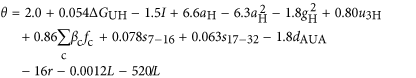

# codon_optimization

This tool mainly implements the calculation of codon influence on mRNA expression, which is descibed in a 2016 Nature work (Boel G et al., Codon influence on protein expression in E. coli correlates with mRNA levels. Nature. 2016 529(7586):358-63.).

They analyzed the sequence features influencing protein expression levels in 6,348 experiments using bacteriophage T7 polymerase to synthesize messenger RNA in Escherichia coli. They devised a new codon-influence metric that correlates only weakly with genomic codon-usage frequency, but strongly with global physiological protein concentrations and also mRNA concentrations and lifetimes in vivo. They found that the codon content influences protein expression more strongly than mRNA-folding parameters, although the latter dominate in the initial ~16 codons. Genes redesigned based on their analyses were translated with higher efficiency in vitro. Concretely, according to their results, logarithm of the odds of observing a high protein expression versus no expression could be given by

where ΔGUH is the predicted free energy of folding of the head plus 5’-untranslated region (UTR), I is a binary indicator that is 1 only if ΔGUH < − 39 kcal mol−1 and the GC content of codons 2–6 is greater than 62%, aH and gH are A and G frequencies in codons 2–6, u3H is the U frequency at the third position in codons 2–6, βc and fc are the slopes and frequencies of each non-termination codon, s7–16 and s17–32 are the mean slopes for codons 7–16 and 17–32, dAUA is a binary variable that is 1 only if there is at least one AUA–AUA di-codon, r is the amino acid repetition rate and L is the DNA sequence length.

In addition, this tool also implements gene re-design methods “6AA” and “31C-FO” described in the paper. 
