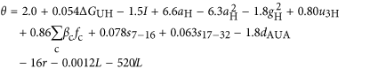
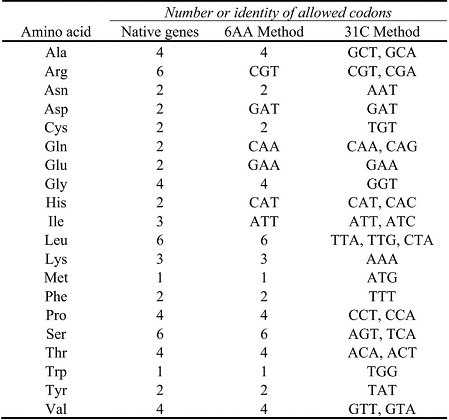

## Codon optimization

Codon optimization toolkit offers several tools with a primary focus on gene coding sequence redesign. It also implements the calculation of codon influence metrics on mRNA expression, as well as back translation from protein sequence to DNA sequence. For more information about this toolkit, please refer to 
> Boel G et al., Codon influence on protein expression in E. coli correlates with mRNA levels. Nature. 2016 529(7586):358-63.

### 1. Codon influence calculate

This tool mainly calculates codon-influence metrics that correlate strongly with global physiological protein concentrations and also mRNA concentrations and lifetimes in vivo. The logarithm of the odds of observing a high protein expression versus no expression could be given by

where delta GUH is the predicted free energy of folding of the head plus 5'-untranslated region (UTR), I is a binary indicator that is 1 only if delta GUH < -39 kcal mol-1 and the GC content of codons 2-6 is greater than 0.62, aH and gH are A and G frequencies in codons 2-6, u3H is the U frequency at the third position in codons 2-6, beta c and fc are the slopes and frequencies of each non-termination codon, s7-16 and s17-32 are the mean slopes for codons 7-16 and 17-32, dAUA is a binary variable that is 1 only if there is at least one AUA-AUA di-codon, r is the amino acid repetition rate and L is the DNA sequence length.

Accordingly, the probability is also given.

### 2. Gene design

This tool implements gene re-design methods "6AA" and "31C-FO". Codons used for synonymous gene design are shown as follows:

The essence of the design of synonymous sequences is that the native degeneracy of the genetic code is reduced to eliminate codons that correlate with reduced protein expression. In the 6AA approach, a single codon is used for 6 amino acids, while codons for the other 14 amino acids are not changed from the wild-type gene sequence. In the 31C-FO approach, the free energy is optimized using only the indicated subset of codons for each amino acid.

### 3. Back translate

This tool is developed with the help of Epoch Life Science. It accepts a protein sequence as input and uses a codon usage table to generate a DNA sequence representing an optimized non-degenerate coding sequence.
